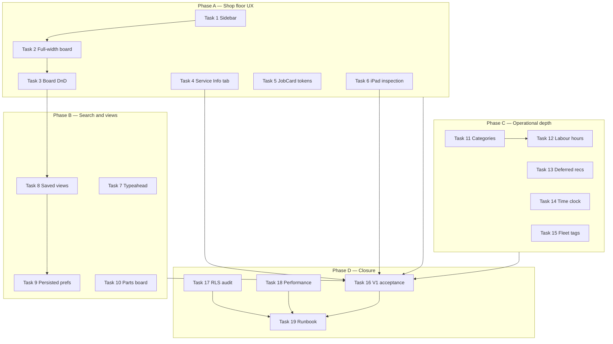
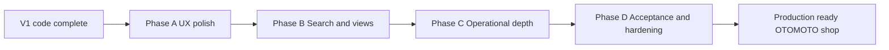

# OTOMOTO V2 Feature Roadmap

> **For agentic workers:** Use subagent-driven-development or executing-plans to implement task-by-task.

**Goal:** Close remaining V1 acceptance gaps, then deliver shop-floor UX polish and operational depth that fit OTOMOTO's internal multi-location workshop (Safari Mac/iPad)—without invoicing, customer portal, or ERP scope creep.

**Architecture:** Extend the existing Next.js App Router + Supabase stack. All new mutations continue through `lib/services/*` with permission → business rule → write → timeline (if WO-related) → audit → `recalculateWorkOrderStatus`. V2 UI work refactors `AppShell` layout and dashboard components; V2 data additions use append-only migrations (`008+`) and optional `user_preference` rows for persisted board/search settings. Drag-and-drop board moves call a new `transitionWorkOrderStatus` service that validates allowed transitions per role before updating status.

**Tech Stack:** Next.js 16 (App Router), TypeScript, Tailwind CSS 4, Zod, Supabase (`@supabase/ssr`), Vitest; add `@dnd-kit/core` + `@dnd-kit/utilities` for Safari-safe kanban drag (Phase A Task 3).

**Spec:** `docs/superpowers/specs/2026-07-08-otomoto-workshop-management-design.md`  
**V1 plan (complete):** `docs/superpowers/plans/2026-07-08-otomoto-workshop-management-implementation.md`  
**Acceptance:** `docs/superpowers/acceptance/v1-checklist.md`

---

## 1. Executive summary

### What V1 delivers today (branch `feature/v1-implementation`)

V1 is **functionally complete in code** for the approved design spec. Staff can run the full repair workflow: customers, motorcycles, location-scoped work orders with per-location numbers (`WO-1001`), auto-created inspections, jobs with approval gates, recommendations (never deleted), parts with order-before-approval enforcement, intake photos, technician notes, QC → ready for pickup → complete, work-order Activity timeline, and owner-only global audit log. Multi-location switching scopes dashboard and operational lists.

Recent UX passes (commits `62a3e80` → `15c8069`) added Shopmonkey/Fullbay-inspired patterns:

| Commit | Delivered |
|--------|-----------|
| `62a3e80` | Dark OTOMOTO chrome, CSS tokens, `StatusBadge`, `PageHeader`, `EmptyState` |
| `cb9d21f` | `ShopBoard` kanban, `WorkOrderCard`, `WorkOrderPipeline`, `TechnicianJobCard` |
| `f78c873` | Global header search, sticky board headers, dashboard New WO CTA |
| `2ddd402` | Columns/List toggle, grouped list, filter chips, hide-empty, card density (URL params) |
| `15c8069` | Scoped search, record counts, `WorkOrderJobTodo` strip, Activity tab rename |
| `e7358c6` | Resume-from-hold action |

**V2 status (2026-07-12):** Tasks **1–13** and **17–19** are implemented on this branch. Tasks **14–15** (time clock + fleet/commercial tags) shipped with migrations `021_customer_account_type.sql` and `022_time_clock.sql`. Task **16** (live acceptance) is **partially** walked on production — remaining items need Safari human (photo intake wizard, inspection auto-save, QC/complete, template rename, Ottawa WO number uniqueness). See `docs/superpowers/acceptance/v1-checklist.md`.

**Not yet done for full V1 sign-off:** Safari Mac/iPad walkthrough of remaining checklist rows.

**Fourth video review status:** Operational wins from video 4 (categories, labour hours, deferred recs) landed via Phase C commits; migration `008` is in tree.

### What V2 adds

V2 is **not a greenfield rebuild**. It closes V1 acceptance, fills spec/UI gaps staff will feel daily on the shop floor, and adds a small set of operational enhancements validated by UX research—while explicitly rejecting invoicing depth, customer portal, inventory ERP, and external procurement integrations.

---

## 2. In scope for V2

| Area | Features |
|------|----------|
| **V1 closure** | Live Supabase acceptance checklist (Tests 1–17 + design extras), Safari Mac/iPad smoke |
| **Shop-floor UX** | Left sidebar nav, full-width workflow board, permission-gated kanban drag-and-drop, iPad fullscreen inspection |
| **WO detail completeness** | Service Info tab (reuse `ServiceInformationForm`), Jobs tab token alignment with `TechnicianJobCard` |
| **Search & views** | Unified typeahead (mixed entity results), shareable filter URLs, persisted board density/column prefs, saved workflow views |
| **Parts visibility** | Cross-WO parts-waiting board/list for front office |
| **Operational depth** | Service catalogue categories, estimated vs actual job hours, deferred recommendation follow-ups, optional simple time clock, optional fleet/commercial customer tags |
| **Production** | RLS audit, query/index review, deploy/runbook updates |

**Thin external-invoice link UI:** Already supported via `external_invoice_number` on work orders. V2 may add a copy-to-clipboard helper or `tel:`/`mailto:` shortcuts on customer contact—**not** invoice generation or payment capture.

---

## 3. Explicitly out of scope

Do **not** implement in V2 unless the user explicitly requests a scope change:

- Invoicing, estimates, payments, accounting sync
- Customer portal, e-signatures, SMS/email marketing (Shopmonkey CRM campaigns)
- Full inventory ERP, stock adjustments, purchase orders, vendor hubs
- PartsTech / external parts ordering integrations
- Labor-rate matrix, commission reports, payroll
- Calendar / appointments / online booking
- DR (driver request) nightly-reset intake queue (fleet grease-shop pattern; low value for OTOMOTO fixed workshop)
- Native iOS/macOS App Store apps
- Full reporting engine / scheduled report builder
- Multi-customer-per-vehicle schema changes
- Hard deletes of operational records

---

## 4. Phased roadmap

### Phase A — UX polish & shop floor (Tasks 1–6)

---

#### Task 1: Left sidebar navigation

**Files:**
- Create: `components/layout/SidebarNav.tsx`
- Modify: `components/layout/AppShell.tsx`
- Modify: `components/layout/Nav.tsx` (retire or reduce to mobile-only)
- Modify: `app/globals.css` (`.app-shell`, `.sidebar`, `.main-content` layout)
- Modify: `app/(app)/layout.tsx` (pass nav props if needed)

- [ ] **Step 1: Add sidebar layout CSS**

In `app/globals.css`, add a two-column shell:

```css
.app-shell {
  display: flex;
  min-height: 100dvh;
}
.sidebar {
  width: 15rem;
  flex-shrink: 0;
  border-right: 1px solid var(--chrome-border);
  background: var(--chrome);
}
.main-content {
  flex: 1;
  min-width: 0;
  overflow-x: auto;
}
@media (max-width: 768px) {
  .sidebar { width: 100%; border-right: none; border-bottom: 1px solid var(--chrome-border); }
  .app-shell { flex-direction: column; }
}
```

- [ ] **Step 2: Create `SidebarNav`**

Port links from `components/layout/Nav.tsx`: Dashboard, Work Orders, Customers, Motorcycles, Technician, Settings. Use vertical stack, `nav-link` tokens, active state via `usePathname`. Include OTOMOTO logo at top linking to `/dashboard`.

- [ ] **Step 3: Refactor `AppShell`**

Replace horizontal header nav with: sidebar (logo + `SidebarNav` + Settings subsection hint) | main column (compact top bar: `GlobalSearch`, `LocationSwitcher`, user/role badge) + `{children}`.

Remove `max-w-6xl` constraint from main (Task 2 will use full width; can land together).

- [ ] **Step 4: Verify Safari**

Run `npm run dev`. Confirm all nav links work; iPad portrait shows usable tap targets (min 44px).

- [ ] **Step 5: Commit**

```bash
git add components/layout app/globals.css app/\(app\)/layout.tsx
git commit -m "feat: add Shopmonkey-style left sidebar navigation"
```

**Verification:** Manual — navigate all primary routes on Mac Safari; sidebar active state correct.

---

#### Task 2: Full-width workflow board layout

**Files:**
- Modify: `components/layout/AppShell.tsx` (remove `max-w-6xl` on main)
- Modify: `app/(app)/dashboard/page.tsx`
- Modify: `app/globals.css` (`.shop-board-wrap`, `.page-stack--wide`)

- [ ] **Step 1: Add wide page variant**

```css
.page-stack--wide {
  max-width: none;
  padding-inline: 1rem;
}
.shop-board-wrap {
  overflow-x: auto;
  -webkit-overflow-scrolling: touch;
}
```

- [ ] **Step 2: Apply to dashboard**

Wrap dashboard board/list in `page-stack page-stack--wide`. Keep detail pages (customers, WO detail) at readable `max-w-6xl` via a `page-stack--narrow` class on those pages only.

- [ ] **Step 3: Commit**

```bash
git commit -m "feat: use full-width layout for workflow board"
```

**Verification:** Dashboard kanban scrolls horizontally on Mac; list view uses full width.

---

#### Task 3: Kanban drag-and-drop with permission-gated status transitions

**Files:**
- Create: `lib/status/transitions.ts`
- Create: `lib/services/workOrderTransitions.ts`
- Create: `app/(app)/work_orders/board-actions.ts`
- Modify: `components/work_orders/ShopBoard.tsx`
- Create: `components/work_orders/DraggableWorkOrderCard.tsx`
- Test: `tests/unit/transitions.test.ts`
- Modify: `package.json` (add `@dnd-kit/core`, `@dnd-kit/utilities`)

- [ ] **Step 1: Install DnD kit**

```bash
npm install @dnd-kit/core @dnd-kit/utilities
```

- [ ] **Step 2: Write failing transition tests**

```ts
// tests/unit/transitions.test.ts
import { describe, it, expect } from "vitest";
import {
  getTargetStatusForColumn,
  canDropInColumn,
} from "@/lib/status/transitions";

describe("board transitions", () => {
  it("maps intake column drop to open", () => {
    expect(getTargetStatusForColumn("intake")).toBe("open");
  });

  it("blocks technician from dropping into quality_check", () => {
    expect(
      canDropInColumn("technician", "qc", "in_progress")
    ).toBe(false);
  });

  it("allows manager to drop in_progress into qc column", () => {
    expect(
      canDropInColumn("manager", "qc", "in_progress")
    ).toBe(true);
  });
});
```

- [ ] **Step 3: Implement `lib/status/transitions.ts`**

Map each `SHOP_BOARD_COLUMNS` id (from `lib/status/pipeline.ts`) to a target `WorkOrderStatus`. Define `canDropInColumn(role, columnId, currentStatus)` using existing `canOverrideWorkOrderStatus`, `canEditWorkOrder`, and rules: completed/cancelled cards are not draggable; `on_hold` only droppable by manager/owner; dropping into `qc` requires all active jobs completed (server re-validates).

- [ ] **Step 4: Server action `moveWorkOrderOnBoard`**

In `lib/services/workOrderTransitions.ts`:

```ts
export async function moveWorkOrderOnBoard(
  workOrderId: string,
  targetColumnId: string
) {
  const user = await requireUser();
  // load WO, verify location_id === active_location_id
  // validate canDropInColumn + business rules (e.g. QC gate)
  // if target implies manual status (on_hold, cancelled) reject on board — use detail actions instead
  // update work_order.status, timeline WORK_ORDER_STATUS_CHANGED, audit, recalculate if needed
}
```

Wire `app/(app)/work_orders/board-actions.ts` as server action wrapper.

- [ ] **Step 5: Client DnD in `ShopBoard`**

Extract `DraggableWorkOrderCard` using `@dnd-kit/core` `useDraggable` on cards and `useDroppable` on column bodies. On drop, call `moveWorkOrderOnBoard`; on error show toast/inline message and revert optimistic UI.

- [ ] **Step 6: Run tests and build**

```bash
npm test -- tests/unit/transitions.test.ts
npm run build
```

- [ ] **Step 7: Commit**

```bash
git commit -m "feat: add permission-gated kanban drag-and-drop for work orders"
```

**Verification:** Manager can drag WO from In progress → Quality check when jobs complete; technician cannot; foreign-location WOs not draggable.

---

#### Task 4: Service Info tab on work order detail

**Files:**
- Modify: `app/(app)/work_orders/[work_order_id]/page.tsx`
- Create: `components/work_orders/ServiceInfoTab.tsx`
- Reuse: `components/forms/ServiceInformationForm.tsx`, `lib/services/motorcycles.ts`, `app/(app)/motorcycles/actions.ts`

- [ ] **Step 1: Load service information in WO page**

Parallel fetch: `getServiceInformation(detail.motorcycle.motorcycle_id)`.

- [ ] **Step 2: Create `ServiceInfoTab`**

Read-only when `detail.is_foreign_location` or `!canUpdateServiceInformation(user.role)`. Otherwise bind `updateServiceInformationAction` with `work_order_id` context so `updateMotorcycleServiceInformation` writes timeline `SERVICE_INFORMATION_UPDATED` on the active WO (already supported in `lib/services/motorcycles.ts` when `workOrderId` passed—verify and pass through action).

- [ ] **Step 3: Replace placeholder**

Remove `ComingSoonPanel` for `service-info` tab; render `<ServiceInfoTab ... />`.

- [ ] **Step 4: Commit**

```bash
git commit -m "feat: add service information tab on work order detail"
```

**Verification:** Edit oil filter from WO Service Info tab → Activity shows Service Information Updated; motorcycle profile reflects change.

---

#### Task 5: Jobs tab design token alignment

**Files:**
- Modify: `components/jobs/JobCard.tsx`
- Modify: `components/jobs/JobsTab.tsx`
- Modify: `app/globals.css` (reuse `.btn`, `.card`, `.status-badge` tokens)

- [ ] **Step 1: Replace zinc hard-coded classes in `JobCard`**

Match `TechnicianJobCard` patterns: `btn btn-primary`, `btn btn-secondary`, `btn btn-accent`, `FormError`, card container using `card card-pad` from globals.

- [ ] **Step 2: Status display**

Use shared `StatusBadge` from `components/ui/StatusBadge.tsx` for job status.

- [ ] **Step 3: Visual QA**

Open WO Jobs tab and Technician page side-by-side; confirm consistent button sizes (min-h-11) and dark chrome compatibility.

- [ ] **Step 4: Commit**

```bash
git commit -m "refactor: align JobCard with operational design tokens"
```

**Verification:** No regression in job approve/decline/start/complete flows.

---

#### Task 6: iPad full-screen inspection flow

**Files:**
- Modify: `app/(app)/work_orders/[work_order_id]/inspection/page.tsx`
- Modify: `components/inspections/InspectionChecklist.tsx`
- Modify: `app/globals.css` (`.inspection-fullscreen` layout)
- Modify: `components/layout/AppShell.tsx` (optional: hide sidebar when `?fullscreen=1`)

- [ ] **Step 1: Fullscreen layout mode**

When route is `/work_orders/[id]/inspection`, render without sidebar (use a minimal `(fullscreen)` layout group or conditional in `(app)/layout.tsx`):

```tsx
// app/(app)/work_orders/[work_order_id]/inspection/layout.tsx
export default function InspectionLayout({ children }: { children: React.ReactNode }) {
  return <div className="inspection-fullscreen">{children}</div>;
}
```

CSS: fixed top bar with WO number + back link; scrollable checklist; sticky section headers; 48px min tap targets on status buttons in `InspectionItemRow`.

- [ ] **Step 2: Link from WO header**

Change "Open full inspection screen →" to primary button; default technicians on iPad to this route from `TechnicianJobCard`.

- [ ] **Step 3: Safari iPad test**

Confirm auto-save states (saving/saved/error) visible; no double-scroll; virtual keyboard does not obscure active row.

- [ ] **Step 4: Commit**

```bash
git commit -m "feat: add iPad-optimized fullscreen inspection layout"
```

**Verification:** Manual on iPad Safari or responsive mode 768×1024.

---

### Phase B — Search & workflow views (Tasks 7–10)

---

#### Task 7: Unified typeahead search

**Files:**
- Create: `lib/services/globalSearch.ts`
- Create: `app/(app)/actions/search.ts`
- Modify: `components/layout/GlobalSearch.tsx`
- Create: `components/layout/SearchTypeahead.tsx`
- Test: `tests/unit/globalSearch.test.ts`

- [ ] **Step 1: Search service**

```ts
// lib/services/globalSearch.ts
export type SearchResult =
  | { type: "work_order"; id: string; label: string; href: string; meta: string }
  | { type: "customer"; id: string; label: string; href: string; meta: string }
  | { type: "motorcycle"; id: string; label: string; href: string; meta: string };

export function rankSearchResults(query: string, results: SearchResult[]): SearchResult[] {
  // WO number prefix match first, then exact customer name, then partial
}
```

Implement `searchAll(query, { locationId, limit: 8 })` calling existing `searchCustomers`, motorcycle search, and dashboard WO query—scoped to active location for WOs.

- [ ] **Step 2: Typeahead UI**

Replace scope `<select>` with single input; debounce 250ms; dropdown with grouped sections (Work orders, Customers, Motorcycles); keyboard ↑↓ + Enter; `/` shortcut focuses search.

- [ ] **Step 3: Tests for ranking**

- [ ] **Step 4: Commit**

```bash
git commit -m "feat: add unified typeahead search with mixed entity results"
```

**Verification:** Typing `WO-1001` shows WO first; typing customer surname shows customer + their bikes + open WOs.

---

#### Task 8: Shareable filter URLs and saved workflow views

**Files:**
- Create: `supabase/migrations/009_user_preferences.sql`
- Create: `lib/services/userPreferences.ts`
- Create: `app/(app)/dashboard/view-actions.ts`
- Modify: `app/(app)/dashboard/page.tsx`
- Modify: `components/work_orders/DashboardFilterChips.tsx`

- [ ] **Step 1: Migration**

```sql
CREATE TABLE user_preference (
  user_id uuid NOT NULL REFERENCES app_user(user_id) ON DELETE CASCADE,
  pref_key text NOT NULL,
  pref_value jsonb NOT NULL,
  updated_at timestamptz NOT NULL DEFAULT now(),
  PRIMARY KEY (user_id, pref_key)
);
```

RLS: user can read/write own rows only.

- [ ] **Step 2: Save/load dashboard view**

`pref_key = 'dashboard_view'`. Store `{ name, params: { view, status, technician_id, flag, q, hide_empty, density } }`. UI: "Save view" button + dropdown of saved views per user. Selecting a view navigates to `/dashboard?{params}`.

- [ ] **Step 3: Shareable URLs**

Existing URL params already work; add "Copy link" button that copies current filter state. Document in chip bar.

- [ ] **Step 4: Commit**

```bash
git commit -m "feat: add saved workflow views and shareable dashboard filter URLs"
```

**Verification:** Save view as advisor → reload → view restores; copied URL opens same filters in new tab.

---

#### Task 9: Persist board column and density preferences

**Files:**
- Modify: `lib/services/userPreferences.ts`
- Modify: `app/(app)/dashboard/page.tsx`
- Modify: `components/work_orders/ShopBoard.tsx`
- Modify: `lib/status/pipeline.ts` (optional column visibility config)

- [ ] **Step 1: Preference keys**

`dashboard_density`: `"compact" | "comfortable"`  
`dashboard_hidden_columns`: `string[]` (column ids from `SHOP_BOARD_COLUMNS`)

- [ ] **Step 2: Load defaults**

On dashboard mount: URL params override saved prefs; saving toggles writes to `user_preference`.

- [ ] **Step 3: Column customize UI**

Gear menu on board: checkboxes for show/hide columns (persisted). Complements existing `hide_empty` (session/URL).

- [ ] **Step 4: Commit**

```bash
git commit -m "feat: persist dashboard column visibility and card density per user"
```

**Verification:** Hide "On hold" column → refresh → still hidden for that user.

---

#### Task 10: Parts-waiting cross-WO view

**Files:**
- Create: `lib/services/partsBoard.ts`
- Create: `app/(app)/parts/page.tsx`
- Modify: `components/layout/SidebarNav.tsx` (add Parts link)
- Create: `components/parts/PartsWaitingBoard.tsx`

- [ ] **Step 1: Query parts waiting across location**

```ts
export async function listPartsWaitingForLocation(locationId: string) {
  // parts with status IN ('needed','ordered') on jobs where WO.location_id = locationId
  // AND WO.status NOT IN ('completed','cancelled')
  // join job name, WO number, customer, bike, ordered_at
}
```

- [ ] **Step 2: Board UI**

Group by `ordered` vs `needed`; card shows part name, job, WO link, customer, days waiting. Filter by technician optional.

- [ ] **Step 3: Permission**

Read: all front office + technicians; status updates still go through existing part actions on WO detail.

- [ ] **Step 4: Commit**

```bash
git commit -m "feat: add cross-work-order parts waiting board"
```

**Verification:** Part on WO A appears on `/parts`; marking received on WO removes from waiting list.

---

### Phase C — Operational depth (Tasks 11–15)

---

#### Task 11: Service catalogue categories (complete video 4 migration)

**Files:**
- Modify: `supabase/migrations/008_job_time_and_service_categories.sql` (already drafted—verify and apply)
- Modify: `lib/services/serviceCatalogue.ts`
- Modify: `lib/validation/schemas.ts`
- Modify: `components/forms/ServiceForms.tsx`
- Modify: `app/(app)/settings/services/page.tsx`
- Modify: `components/forms/CreateWorkOrderForm.tsx`, `components/jobs/JobsTab.tsx`
- Test: `tests/unit/serviceCategories.test.ts`

- [ ] **Step 1: Finalize migration 008**

Ensure `ALTER TABLE service ADD COLUMN category text` + backfill UPDATEs for seeded services. Apply to Supabase.

- [ ] **Step 2: Implement `groupServicesByCategory`**

Pure helper + tests; use `<optgroup>` in service `<select>` elements.

- [ ] **Step 3: Settings UI**

Category field on create/edit service; group list headings on settings page.

- [ ] **Step 4: Commit**

```bash
git commit -m "feat: add service catalogue categories with grouped pickers"
```

**Verification:** Add job dropdown shows Maintenance / Brakes & Tires groups.

---

#### Task 12: Estimated vs actual labour hours

**Files:**
- Modify: `supabase/migrations/008_job_time_and_service_categories.sql` (`job.started_at`)
- Modify: `lib/services/jobs.ts` (set `started_at` on first transition to `in_progress`)
- Create: `lib/services/labour.ts`
- Modify: `components/jobs/JobCard.tsx`, `components/work_orders/WorkOrderHeader.tsx`
- Test: `tests/unit/labour.test.ts`

- [ ] **Step 1: Record start time**

In `updateJobStatus`, when new status is `in_progress` and `started_at IS NULL`, set `started_at = now()`.

- [ ] **Step 2: Labour helper**

```ts
export function formatLabourComparison(
  estimatedHours: number | null,
  startedAt: string | null,
  completedAt: string | null
): { label: string; overEstimate: boolean } | null
```

Actual hours = `(completedAt ?? now) - startedAt` in decimal hours.

- [ ] **Step 3: Display**

JobCard: "Est 1.5h · Actual 2.1h" with amber/red when actual > estimate × 1.1. WorkOrderHeader: sum of estimated hours for active jobs.

- [ ] **Step 4: Commit**

```bash
git commit -m "feat: show estimated vs actual labour hours on jobs"
```

**Verification:** Start and complete job → actual hours displayed; timeline unchanged.

---

#### Task 13: Deferred recommendation follow-ups

**Files:**
- Modify: `lib/services/recommendations.ts`
- Create: `components/recommendations/OutstandingRecommendations.tsx`
- Modify: `app/(app)/motorcycles/[motorcycle_id]/page.tsx`
- Modify: `components/recommendations/RecommendationsTab.tsx`
- Modify: `components/forms/CreateWorkOrderForm.tsx` (banner when bike selected)

- [ ] **Step 1: Query outstanding recommendations**

```ts
export async function listOutstandingRecommendationsForMotorcycle(
  motorcycleId: string,
  excludeWorkOrderId?: string
) {
  // status IN ('pending','deferred','declined') from WOs for this motorcycle
  // exclude completed/cancelled WOs
}
```

- [ ] **Step 2: Motorcycle detail section**

"Follow-up from previous visits" with severity badge, description, source WO link, status.

- [ ] **Step 3: WO Recommendations tab panel**

"Previously deferred on this motorcycle" above current WO recommendations.

- [ ] **Step 4: Commit**

```bash
git commit -m "feat: surface deferred recommendations for motorcycle follow-up"
```

**Verification:** Defer recommendation on WO-1001 → visible on bike profile when WO-1002 opened.

---

#### Task 14: Optional simple time clock (technician punch)

**Files:**
- Create: `supabase/migrations/010_time_clock.sql`
- Create: `lib/services/timeClock.ts`
- Create: `app/(app)/technician/clock-actions.ts`
- Modify: `app/(app)/technician/page.tsx`
- Create: `components/technician/TimeClockWidget.tsx`

- [ ] **Step 1: Schema**

```sql
CREATE TABLE time_clock_entry (
  entry_id uuid PRIMARY KEY DEFAULT gen_random_uuid(),
  user_id uuid NOT NULL REFERENCES app_user(user_id),
  location_id uuid NOT NULL REFERENCES location(location_id),
  clock_in_at timestamptz NOT NULL DEFAULT now(),
  clock_out_at timestamptz,
  notes text
);
CREATE INDEX idx_time_clock_open ON time_clock_entry(user_id) WHERE clock_out_at IS NULL;
```

- [ ] **Step 2: Punch in/out**

Technician only; one open entry per user; audit log on clock in/out.

- [ ] **Step 3: Widget on technician page**

Show elapsed time when clocked in; manager read-only list optional in Settings later.

- [ ] **Step 4: Commit**

```bash
git commit -m "feat: add optional technician time clock punch in/out"
```

**Verification:** Technician clocks in → entry created; second punch in blocked; clock out closes entry.

---

#### Task 15: Fleet/commercial customer tags (simple)

**Files:**
- Create: `supabase/migrations/011_customer_tags.sql`
- Modify: `lib/services/customers.ts`
- Modify: `components/forms/CustomerForm.tsx`
- Modify: `app/(app)/customers/page.tsx` (filter chip `tag=fleet`)

- [ ] **Step 1: Schema**

```sql
ALTER TABLE customer ADD COLUMN account_type text NOT NULL DEFAULT 'retail'
  CHECK (account_type IN ('retail', 'fleet', 'commercial'));
```

- [ ] **Step 2: UI**

Dropdown on customer form; badge on customer list/detail; dashboard filter optional.

- [ ] **Step 3: Commit**

```bash
git commit -m "feat: add fleet and commercial account type tags on customers"
```

**Verification:** Set customer to fleet → badge visible; filter shows only fleet customers.

---

### Phase D — V1 acceptance closure & production hardening (Tasks 16–19)

---

#### Task 16: V1 acceptance checklist walkthrough

**Files:**
- Modify: `docs/superpowers/acceptance/v1-checklist.md` (check boxes as completed)
- Modify: `README.md` (getting started, bootstrap steps)
- Fix any gaps discovered during walkthrough in relevant service/UI files

- [ ] **Step 1: Configure live Supabase**

Apply migrations `001`–`011` (or through latest at time of walkthrough). Run `supabase/seed/dev_bootstrap.sql`. Link Auth user as owner.

- [ ] **Step 2: Run automated tests**

```bash
npm test
```

Expected: all PASS.

- [ ] **Step 3: Walk Tests 1–17 in Safari**

Follow `docs/superpowers/acceptance/v1-checklist.md` exactly. Record failures.

- [ ] **Step 4: Walk design extras**

Location scoping, per-location WO numbers, audit gating, parts gate, recommendation permanence, template snapshots.

- [ ] **Step 5: Fix gaps and commit**

```bash
git commit -m "test: close V1 acceptance gaps from checklist"
```

**Verification:** Sign-off table in checklist fully checked.

---

#### Task 17: RLS security audit

**Files:**
- Modify: `supabase/migrations/006_rls_policies.sql` (or new `012_rls_hardening.sql`)
- Create: `docs/superpowers/acceptance/rls-audit.md`
- Modify: `lib/services/audit.ts`

- [ ] **Step 1: Document policy matrix**

For each table: who SELECT/INSERT/UPDATE; confirm `audit_log` owner-only SELECT.

- [ ] **Step 2: Test as roles**

Using Supabase SQL or integration script: verify technician cannot UPDATE `customer` rows they shouldn't; non-owner cannot SELECT `audit_log`.

- [ ] **Step 3: Harden gaps**

Add missing policies (e.g. `user_preference`, `time_clock_entry` from Phase C).

- [ ] **Step 4: Commit**

```bash
git commit -m "security: harden RLS policies and document audit matrix"
```

**Verification:** `rls-audit.md` complete; no owner-only table readable by technician JWT.

---

#### Task 18: Performance hardening

**Files:**
- Create: `supabase/migrations/013_performance_indexes.sql`
- Modify: `lib/services/dashboard.ts`, `lib/services/workOrders.ts`

- [ ] **Step 1: Add indexes**

```sql
CREATE INDEX IF NOT EXISTS idx_work_order_status_location
  ON work_order (location_id, status) WHERE status NOT IN ('completed','cancelled');
CREATE INDEX IF NOT EXISTS idx_part_status ON part (status) WHERE status IN ('needed','ordered');
CREATE INDEX IF NOT EXISTS idx_job_work_order ON job (work_order_id);
```

- [ ] **Step 2: Review N+1 queries**

Dashboard board load: single query with joins for cards; avoid per-card fetches.

- [ ] **Step 3: Commit**

```bash
git commit -m "perf: add operational indexes and streamline dashboard queries"
```

**Verification:** Dashboard loads < 2s with 200 WOs on dev seed (document baseline in README).

---

#### Task 19: Production runbook

**Files:**
- Modify: `README.md`
- Create: `docs/superpowers/acceptance/production-checklist.md`

- [ ] **Step 1: Document env vars, migration order, seed strategy**

- [ ] **Step 2: Safari deployment notes**

Vercel/hosting, Supabase Storage bucket `intake-photos`, cookie settings for auth.

- [ ] **Step 3: Production checklist**

Backups, owner account recovery, location bootstrap, monitoring Supabase advisors.

- [ ] **Step 4: Commit**

```bash
git commit -m "docs: add production runbook and deployment checklist"
```

**Verification:** New engineer can follow README from empty clone to running shop.

---

## 5. Priority matrix

| Priority | Item | Rationale |
|----------|------|-----------|
| **Must** | Task 16 — V1 acceptance closure | Spec sign-off; proves daily workflow works on live Supabase + Safari |
| **Must** | Task 4 — Service Info tab | Explicit V1 design screen still placeholder |
| **Must** | Task 6 — iPad inspection fullscreen | Technicians primary client; inspection is highest-frequency iPad flow |
| **Must** | Task 17 — RLS audit | Multi-role shop handling customer/WO data; defense in depth before production |
| **Should** | Task 1 — Sidebar nav | Shopmonkey muscle memory; reduces header crowding with global search |
| **Should** | Task 3 — Board DnD | Front office lives on workflow board; drag matches paper kanban mental model |
| **Should** | Task 7 — Unified typeahead | Faster lookup than scope dropdown + navigate |
| **Should** | Task 10 — Parts waiting board | Parts delays are daily pain; cross-WO view avoids hunting WOs |
| **Should** | Task 11–13 — Categories, labour hours, deferred follow-ups | Low-cost operational wins from video 4 analysis; migration 008 already drafted |
| **Should** | Task 5 — JobCard token alignment | Visual consistency reduces training friction between advisor and tech views |
| **Could** | Task 2 — Full-width board | Nice on ultrawide Mac; pairs with Task 1 |
| **Could** | Task 8–9 — Saved views + persisted prefs | Power users; URL params work today |
| **Could** | Task 14 — Time clock | Useful for payroll insight; not blocking workflow |
| **Could** | Task 15 — Fleet tags | Only if OTOMOTO commercial/fleet volume justifies filter |
| **Could** | Task 18–19 — Perf + runbook | Important before go-live; can parallelize with Phase A |
| **Won't (V2)** | Invoicing, portal, SMS, inventory ERP | Spec non-goals; external tools remain source of truth |
| **Won't (V2)** | Calendar, DR queue, PartsTech, PO/vendor hubs | Fleet/grease-shop patterns; scope creep for fixed workshop |
| **Won't (V2)** | Labor-rate matrix, commission reports | Pricing/payroll outside repair workflow app |
| **Won't (V2)** | Native App Store apps | Safari web remains Apple-first delivery |

---

## 6. Dependencies



**Recommended execution order:**

1. **Task 16 prep** — stand up live Supabase early (can run in parallel with Phase A).
2. **Tasks 4, 6** — close spec-visible gaps (no new deps).
3. **Tasks 1, 2, 5** — layout polish.
4. **Task 3** — after transition rules tested.
5. **Tasks 11, 12, 13** — complete aborted video 4 work (migration 008).
6. **Tasks 7, 8, 9, 10** — search/views layer.
7. **Tasks 14, 15** — optional depth if approved.
8. **Tasks 17, 18, 19** — harden before production cutover.

---

## 7. Phase diagram



| Phase | Tasks | Count |
|-------|-------|-------|
| A — UX polish & shop floor | 1–6 | 6 |
| B — Search & workflow views | 7–10 | 4 |
| C — Operational depth | 11–15 | 5 |
| D — Acceptance & hardening | 16–19 | 4 |
| **Total** | | **19** |

---

## 8. Self-review against spec and deferred lists

### Spec coverage

| Spec requirement | V1 status | V2 task |
|------------------|-----------|---------|
| Service information on WO detail | Placeholder | Task 4 |
| Safari Mac/iPad operational UI | Partial (inspection page light theme) | Task 6 |
| Dashboard workflow | Implemented | Tasks 2, 3, 9 |
| Search customers/motorcycles/WOs | Scoped search | Task 7 |
| No invoicing/portal | Enforced | Out of scope §3 |
| Timeline + audit on mutations | Implemented | Tasks 3, 11–14 maintain pattern |
| Multi-location | Implemented | All queries stay location-scoped |
| Task 35 acceptance | Not walked live | Task 16 |

### UX research deferred items — mapped

| Deferred item (videos 1–4) | Disposition |
|----------------------------|-------------|
| Drag-and-drop kanban | Task 3 |
| Left sidebar nav | Task 1 |
| Customizable columns & density persistence | Task 9 |
| Unified typeahead | Task 7 |
| Full-width board | Task 2 |
| iPad fullscreen inspection | Task 6 |
| Shareable filter URLs / saved views | Task 8 |
| Parts sub-board / cross-WO parts waiting | Task 10 |
| JobCard token alignment | Task 5 |
| Service info tab | Task 4 |
| Time clock / labor tracking | Task 14 (optional); Task 12 (job hours) |
| Fleet/commercial grouping | Task 15 (optional) |
| Vendor PO, PartsTech, labor matrix | Won't §3 |
| Calendar, DR queue, inventory, reports hubs | Won't §3 |
| Resume-from-hold | **Done** (`e7358c6`) |
| Service categories, est vs actual hours, deferred rec surfacing | Tasks 11–13 (video 4 incomplete commit) |
| Fourth video commit | **Not merged** — Phase C completes it |

### Placeholder scan

No TBD task bodies; each task names files, commands, and verification steps.

---

## 9. Execution handoff

Plan saved to `docs/superpowers/plans/2026-07-09-otomoto-v2-feature-roadmap.md`.

**Two execution options:**

1. **Subagent-driven (recommended)** — one fresh subagent per task, review between tasks.
2. **Inline execution** — run tasks in-session with executing-plans checkpoints.

**Top 5 recommended next tasks (after user approval):**

1. **Task 16** — Configure live Supabase and walk V1 acceptance checklist (unblocks production confidence).
2. **Task 4** — Wire Service Info tab on work order detail (last V1 spec placeholder).
3. **Task 6** — iPad fullscreen inspection layout (technician daily path).
4. **Tasks 11–13** — Complete video 4 operational wins (migration 008 + categories, labour comparison, deferred follow-ups).
5. **Task 3** — Permission-gated kanban drag-and-drop (highest-impact front-office workflow UX).

Which approach?
