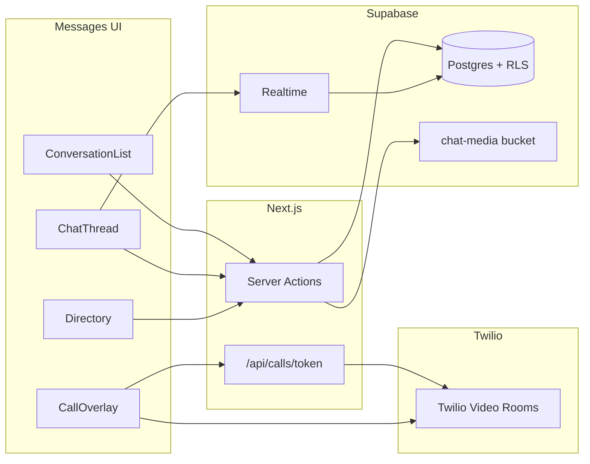

# Company Messenger — Design Spec

**Date:** 2026-07-13
**Status:** Approved design — pending implementation plan
**Related:** [docs/superpowers/specs/2026-07-13-twilio-messaging-compliance-design.md](2026-07-13-twilio-messaging-compliance-design.md) (customer SMS stays separate); existing Twilio send/status/inbound stack (`lib/twilio/`)

## Goal

Give staff an internal, iMessage-style company messenger — 1:1 and group chats, media, voice notes, reactions, and voice/video calls — fully separate from customer-facing SMS on the work order.

## Scope

- **Audience:** Location-first directory (staff at the viewer's active location sorted to top), but anyone company-wide can be messaged.
- **Features:** 1:1 + group chats; text/photos/voice notes; read receipts; typing indicators; reply-to; emoji reactions; edit; unsend; delete-for-me; search; mute; pin; voice + video calls.

## Out of scope

- Customer SMS (stays on the work-order Messages / Twilio SMS stack).
- External contacts — company staff only.
- Effects, stickers, Memoji.

## Decisions (locked)

| Concern             | Choice                                          | Why                                                                                                                  |
| ------------------- | ----------------------------------------------- | -------------------------------------------------------------------------------------------------------------------- |
| Chat store          | New Postgres tables + RLS                       | Matches `app_user` / `requireUser()` patterns used everywhere else in the app                                        |
| Live updates        | Supabase Realtime on message/participant tables | Already on `@supabase/supabase-js`; no new infra (this is the first feature in the app to use Realtime)              |
| Media / voice notes | Supabase Storage `chat-media` bucket            | Same pattern as [lib/services/photos.ts](../../../lib/services/photos.ts)                                            |
| Voice / video calls | Twilio Video                                    | Account already used for SMS ([lib/twilio/](../../../lib/twilio/)); rooms + access tokens minted from a server route |
| Identity            | `app_user.user_id`                              | Never the Auth UUID in foreign keys                                                                                  |

## Architecture

## Data model

New migration `supabase/migrations/038_staff_messenger.sql`:

- `chat_conversation` — `dm` / `group`, optional title, `created_by_user_id`, `last_message_at`.
- `chat_participant` — membership + `last_read_at`, `muted_at`, `pinned_at`, `hidden_at` (delete-for-me / leave).
- `chat_message` — `text` / `image` / `audio` / `system` / `call_event`; `body`; `reply_to_message_id`; `edited_at`; `unsent_at`.
- `chat_attachment` — `storage_path`, `mime_type`, `bytes`, `duration_ms` (voice notes).
- `chat_reaction` — unique on `(message_id, user_id, emoji)`.
- `chat_call` — `audio` / `video`, Twilio room name/SID, `status` (`ringing` / `active` / `ended` / `missed`), timestamps.

**DM uniqueness:** partial unique index on the sorted participant pair for `type = 'dm'`, so "message X" always opens the same thread instead of creating duplicates.

**RLS:** participants only, via `current_app_user_id()`; insert messages only if an active (non-`left_at`) participant; reactions/reads follow the same rule. Never trust a client-supplied `sender_user_id` — RLS checks it equals `current_app_user_id()`.

**Realtime:** enable the `supabase_realtime` publication on `chat_message`, `chat_reaction`, `chat_participant`, `chat_call`.

## App surface

Wire into the reserved **Communication** slot in [components/layout/SidebarNav.tsx](../../../components/layout/SidebarNav.tsx) (currently an empty category with a "no standalone communications page yet" placeholder):

- Messages → `/messages`
- Directory → `/messages/directory` (also reachable as a sheet/tab from compose — no separate nav entry needed)

Routes:

- `app/(app)/messages/page.tsx` — two-pane iMessage layout (list + empty state)
- `app/(app)/messages/[conversation_id]/page.tsx` — selected thread
- `app/(app)/messages/directory/page.tsx` — people browser
- `app/(app)/messages/new/page.tsx` — compose (pick people → DM or group)

Add `/messages` to the `PROTECTED_PREFIXES` array in [middleware.ts](../../../middleware.ts).

**Permission:** `canUseMessenger(role)` in [lib/permissions/checks.ts](../../../lib/permissions/checks.ts) → true for all active roles (`owner`, `manager`, `service_advisor`, `technician`, `admin`).

## Services & actions

Follow the existing pattern: `lib/services/*` + thin `"use server"` actions.

| Module                           | Responsibility                                                                                       |
| -------------------------------- | ---------------------------------------------------------------------------------------------------- |
| `lib/services/directory.ts`      | List active staff company-wide; sort active-location members first, then others; search by name/role |
| `lib/services/messenger.ts`      | Conversations, send/edit/unsend, read, mute/pin/hide, search, attachments                            |
| `lib/services/messengerCalls.ts` | Create/accept/decline/end call rows; emit system/`call_event` messages                               |
| `lib/twilio/video.ts`            | Room create + JWT access tokens (API key/secret env vars)                                            |
| `app/api/calls/token/route.ts`   | Authenticated token endpoint for the Twilio Video client                                             |
| `app/(app)/messages/actions.ts`  | Server actions wrapping services + `revalidatePath`                                                  |

Key behaviors:

- **Start DM:** find-or-create by participant pair (sorted key), race-safe via the unique index.
- **Group:** create with title + member list; add/remove members (creator + owners/managers).
- **Unsend:** set `unsent_at`; body cleared for everyone (within e.g. 15 min of sending).
- **Delete for me:** set `chat_participant.hidden_at`; does not remove the message for others.
- **Read receipts:** update `last_read_at`; UI shows Delivered / Read like iMessage.
- **Typing:** ephemeral Realtime broadcast on the conversation channel — not persisted.
- **Search:** `ILIKE` on message body, scoped to conversations the user is in.

## UI (iMessage-like)

New components under `components/messages/`:

- **MessengerShell** — split pane; on mobile/iPad portrait, list ↔ thread navigation.
- **ConversationList** — pinned section, then recent; unread badge; mute indicator; last preview.
- **ChatThread** — bubbles (own = brand accent orange, theirs = neutral gray), day separators, reply quote, reactions row, long-press/context menu (reply, react, copy, edit, unsend, delete).
- **Composer** — text, photo attach, hold-to-record voice note, send; call buttons (audio / video) in the header.
- **DirectoryList** — sections "At this location" / "All company"; tap → open/create DM; multi-select → new group.
- **CallOverlay** — full-screen/incoming banner; mute, camera toggle, end; uses the Twilio Video JS SDK.

Preserve existing design tokens (Space Grotesk, brand accent orange `--accent`, `.btn` / `.input`) — chat chrome should feel iMessage-like without introducing a purple/default AI theme.

**Client Realtime:** browser Supabase client ([lib/database/supabase-browser.ts](../../../lib/database/supabase-browser.ts)) subscribed per open conversation, plus a personal `user:{id}` channel for inbox bumps and incoming calls.

## Voice / video calls

1. User taps audio/video in a conversation header (or Directory → Call).
2. Server creates `chat_call` + Twilio room; inserts a `call_event` message; Realtime notifies participants.
3. Callee sees incoming UI → Accept loads a Twilio token from `/api/calls/token` and joins the room; Decline marks the call missed/ended.
4. Group calls: same room; all conversation participants may join while status is `ringing` / `active`.
5. End call updates `chat_call` + posts a system line ("Video call · 4:12").

## Environment

New variables (document alongside existing secrets in `.env.local.example`):

| Variable                | Purpose                                                                   |
| ----------------------- | ------------------------------------------------------------------------- |
| `TWILIO_API_KEY_SID`    | Twilio Video access-token signing key                                     |
| `TWILIO_API_KEY_SECRET` | Twilio Video access-token signing secret                                  |
| `TWILIO_ACCOUNT_SID`    | Already present via [lib/twilio/config.ts](../../../lib/twilio/config.ts) |

Note: this repo calls the Twilio REST API directly with `fetch` today (no `twilio` npm package). Server-side Video access tokens and room management need either the official `twilio` package (simplest — `AccessToken` + `VideoGrant`) or hand-rolled JWT signing; the browser call UI needs the `twilio-video` client package. Both are new dependencies — see implementation plan.

## Testing

- **Unit:** DM find-or-create idempotency, permission gates, directory sort (location first), unsend window, participant RLS assumptions (via service error codes, not live RLS).
- **Light Playwright:** open Messages, start a DM from the directory, send text (skip live Twilio in CI with a mocked token route).

## Implementation order

Work in vertical slices so each step is usable:

1. Migration + types + `canUseMessenger` + nav + empty `/messages` shell
2. Directory service/UI + find-or-create DM + text send/list + Realtime
3. Groups, read receipts, typing, reply, reactions
4. Photos + voice notes (Storage) + edit/unsend/delete-for-me
5. Search, mute, pin
6. Twilio Video tokens + call lifecycle UI

See [docs/superpowers/plans/2026-07-13-company-messenger.md](../plans/2026-07-13-company-messenger.md) for the task-by-task breakdown.
